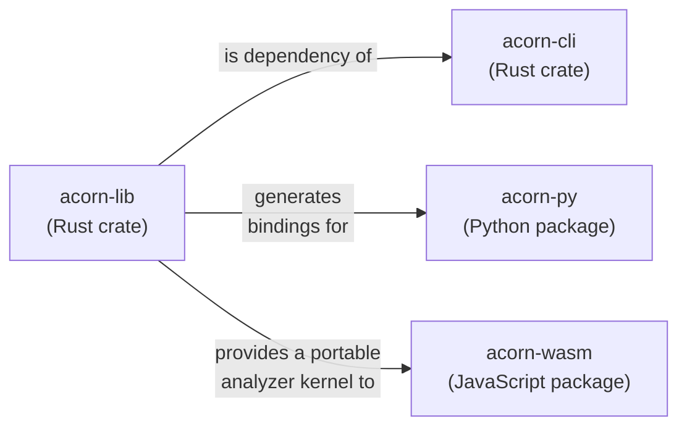

# 📦 Packages

To enable broad adoption of ACORN, we provide packages for multiple popular programming contexts.

```mermaid
graph LR
    A["acorn-lib</br>(Rust crate)"] -->|"&nbsp;is dependency of&nbsp;"|B["acorn-cli</br>(Rust crate)"]
    A -->|"generates</br>&nbsp;bindings for&nbsp;"|C["acorn-py</br>(Python package)"]
    A -->|"provides a portable</br>&nbsp;analyzer kernel to&nbsp;"|D["acorn-wasm</br>(JavaScript package)"]
```
